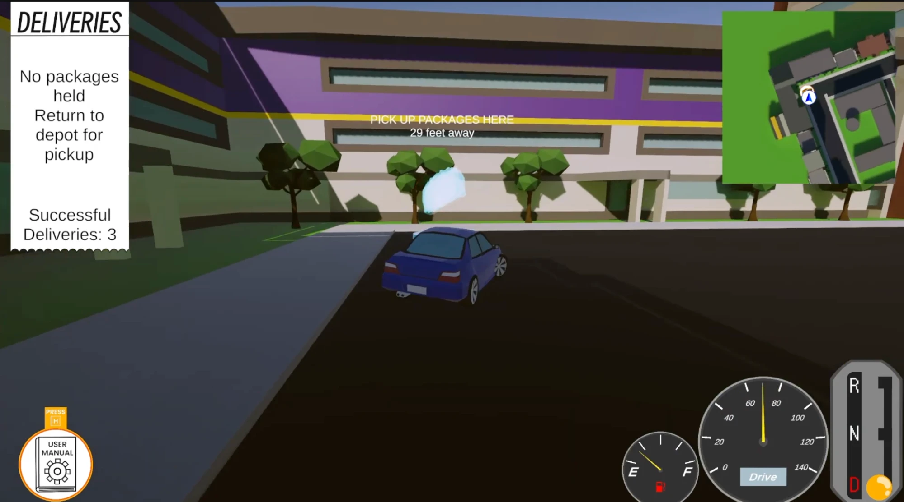

# Cuisine Cabbie

[](https://github.com/chaezuha/Cuisine-Cabbie/releases/latest)
[](https://unity.com/releases/editor/archive)

A 3D food delivery driving game built in Unity 6 (C#). You are a delivery driver with a questionable manual car: pick up orders at the depot, drop them off around a campus-inspired city, and keep your tank from running dry. You get paid in fuel. If you run out, you're fired.

Made for CTIN 489 (Spring 2026) as a collaboration between USC Games and Berklee College of Music.



## Features

- **Manual gearbox:** Shift between Reverse, Neutral, and Drive yourself with the brake and scroll wheel. It takes a minute to get used to, and that's the point.
- **Fuel is your paycheck:** Picking up at the depot fills your tank, and every delivery earns more fuel. Crashes cost fuel, and crawling around burns it faster than driving with purpose.
- **Delivery runs that grow:** Carry up to three orders per trip. Your first trip stays close to the depot, then each run sends you farther across the map and to a new depot.
- **A campus-inspired city:** Drive a map modeled on USC's main campus with around 90 named delivery stops.
- **Drift and crash feel:** Hold Space to drift through corners. Hits shake the camera and drain your tank based on how hard you hit.
- **Readable HUD:** A fuel gauge, speedometer, gear shifter, delivery list, minimap, and on-screen markers that stick to the screen edge so you always know where to go.
- **In-game manual:** A short illustrated manual opens when you start and any time you press H.
- **Original music and sound:** A custom soundtrack and sound effects, including a low-fuel music cue.

## Quick start

You need Windows or macOS and about 400 MB of free space.

1. Download the build for your system from the [v1.0.0 release](https://github.com/chaezuha/Cuisine-Cabbie/releases/tag/v1.0.0).
2. Unzip it.
3. Launch the game.

On macOS (Terminal):

```bash
# Download the macOS build (about 400 MB)
curl -L -o cuisine-cabbie-mac.zip https://github.com/chaezuha/Cuisine-Cabbie/releases/download/v1.0.0/cusine-cabbie-rc1-mac.zip
# Unzip it (creates cusine-cabbie-rc1-mac.app)
unzip -q cuisine-cabbie-mac.zip
# Launch the game
open cusine-cabbie-rc1-mac.app
```

On Windows (PowerShell):

```powershell
# Download the Windows build (about 390 MB)
curl.exe -L -o cuisine-cabbie-win.zip https://github.com/chaezuha/Cuisine-Cabbie/releases/download/v1.0.0/cuisine-cabbie-rc1-win.zip
# Unzip it (creates the cuisine-cabbie-rc1-win folder)
tar -xf cuisine-cabbie-win.zip
# Launch the game
& ".\cuisine-cabbie-rc1-win\Vertical Slice b1.exe"
```

That's it. Press **Play Game**, read the manual, then hold **S** and scroll to shift out of Neutral into Drive.

> **macOS says the app is damaged or can't be opened?** This happens when you download the zip in a browser. Run `xattr -cr cusine-cabbie-rc1-mac.app` in the folder you unzipped to, then open it again. On Windows, if SmartScreen appears, click **More info**, then **Run anyway**.

## How to play

1. Drive to the depot marker and pick up your orders (up to three). Your tank fills up.
2. Deliver each order to its named stop. The delivery list, minimap, and on-screen markers show where to go. Each drop-off earns fuel.
3. When your last order is delivered, a new depot opens somewhere else on the map. You get a fuel top-up for the drive there.
4. Repeat. Run out of fuel and it's game over. You can restart or go back to the main menu.

### Controls

| Input | Action |
| --- | --- |
| W | Gas |
| S | Brake |
| A / D | Steer left / right |
| Space | Drift (hold while accelerating and steering) |
| Hold S + scroll up | Shift up a gear (Reverse → Neutral → Drive) |
| Hold S + scroll down | Shift down a gear (Drive → Neutral → Reverse) |
| H | Open the manual |
| Esc | Pause menu (resume, settings, main menu, quit) |

You can only shift while holding the brake. Shifting into Reverse also needs you to be nearly stopped. You start in Neutral.

On a Mac with natural scrolling, the scroll direction is flipped. Turn on **Invert scroll** in [Settings](#settings) if shifting feels backwards.

## Settings

Open the pause menu with Esc, then choose **Settings**.

| Setting | What it does |
| --- | --- |
| Framerate | Caps the frame rate at 30, 60, 120, or 144, or leaves it uncapped. Default: Unlimited. |
| Volume | Sets the master volume for music and sound effects. Default: full volume. |
| Invert scroll | Swaps which scroll direction shifts up and which shifts down. Default: off. |

## Other ways to run

### From source in the Unity editor

You need [Unity Hub](https://unity.com/download) and Unity **6000.3.2f1**. Git LFS is not required.

```bash
# Clone the project
git clone https://github.com/chaezuha/Cuisine-Cabbie.git
```

1. In Unity Hub, click **Add** > **Add project from disk** and pick the `Cuisine-Cabbie` folder.
2. If Hub asks, install editor version 6000.3.2f1. The first open takes a while because Unity rebuilds the `Library` folder.
3. Open [`Assets/Scenes/MainMenu.unity`](Assets/Scenes/MainMenu.unity) and press **Play**.

### Build it yourself

1. Open **File** > **Build Profiles**.
2. Check that the scene list contains `Scenes/MainMenu` first and `Scenes/Driving` second (both are already set up).
3. Pick your platform (Windows or macOS) and click **Build**.

## Playtest telemetry

The game writes a CSV file for each play session. Each row is one leg of a trip (depot to stop, or stop to stop) with the time taken, fuel used and remaining, collisions, distance, average speed, and why the run ended.

| System | Folder |
| --- | --- |
| Windows | `%USERPROFILE%\AppData\LocalLow\DefaultCompany\Vertical Slice b1\Telemetry` |
| macOS | `~/Library/Application Support/DefaultCompany/Vertical Slice b1/Telemetry` |

Files are named `session_YYYY-MM-DD_HH-MM-SS.csv`. You can delete the folder at any time.

## Development

| Path | What's there |
| --- | --- |
| [`Assets/Scripts/CarStuff`](Assets/Scripts/CarStuff) | Car movement, gearbox, fuel, speedometer, car audio, camera shake |
| [`Assets/Scripts/DeliveryMechanics`](Assets/Scripts/DeliveryMechanics) | Pickups, drop-offs, trip logic, waypoints, minimap icons, telemetry |
| [`Assets/Scripts/MenuScripts`](Assets/Scripts/MenuScripts) | Main menu, pause menu, settings, manual panels, game over screen |
| [`Assets/Scenes`](Assets/Scenes) | `MainMenu` and `Driving` (the whole city) |
| [`Assets/Prefabs`](Assets/Prefabs) | Modular buildings, roads, sidewalks, trees, depot, drop-off markers |
| [`Assets/Audio`](Assets/Audio) | Music and sound effects |

### Tuning the game

Balance values live in the Inspector on objects in the `Driving` scene, so you can tweak them without touching code:

- **Car > Player Controller:** Max fuel, refuel amounts, fuel burn rates, crash fuel loss thresholds, fuel economy by speed, and shift cooldown.
- **Car > Delivery Brain:** Packages per trip, how far trips spread out (max radius and number of rings), the starting depot, and the tutorial drop-offs used on your first trip.
- **Each drop-off:** Its display name, plus optional overrides for which ring it belongs to and how much fuel it pays.

There are no automated tests or CI for this project.

## Credits

- **USC Games:** Ethan and Harley
- **Berklee College of Music:** Nate

## Disclaimer

Student project for CTIN 489 at the University of Southern California, Spring 2026. All rights reserved by the authors. Not affiliated with or endorsed by USC beyond the course.
